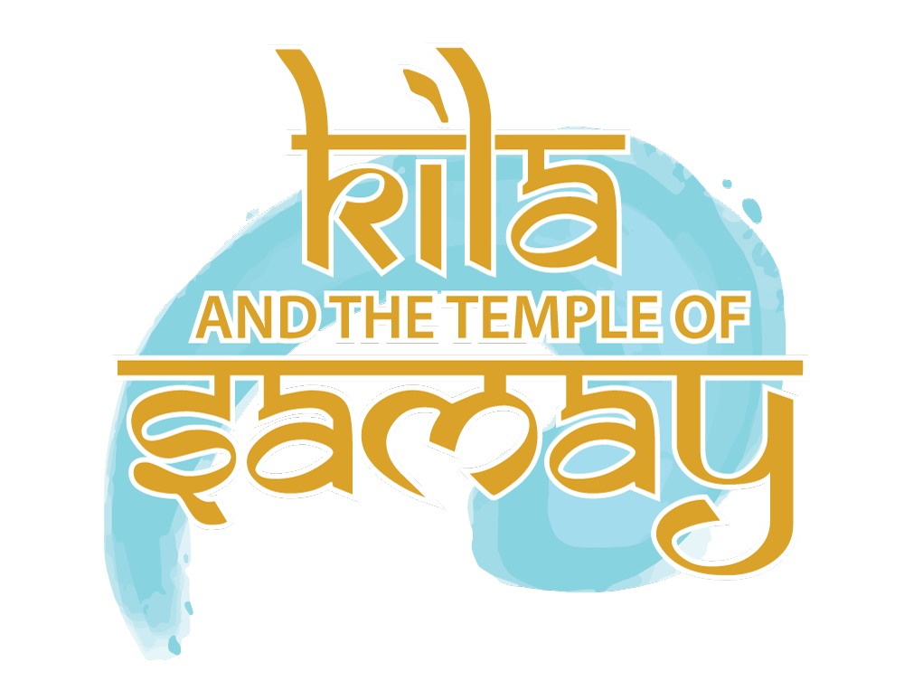

<h1 align="center">
  
</h1>

### Preliminary:
#### Development Period
Kila and the Temple of Samay was developed during the 4th semester of the Bachelor's degree in Media Technology at FH St. Pölten. The development period lasted from April 3rd to June 12th, 2024.

#### Details
The game was developed in Unity version 2022.3.5f1 for the platforms PC and Windows-based handhelds.

---

### Gameplay
<b>Kila and the Temple of Samay</b> combines adventure and puzzle elements in an atmospheric setting, inspired by Indian mythology and history. With a captivating story, challenging puzzles, and innovative time mechanics, the game offers a unique gameplay experience.
The game consists of multiple levels within the temple ruin, which become increasingly difficult and introduce new mechanics and traps. The first playable prototype includes the basic movement system, the time mechanic, and some simple puzzles.

### Story:

#### Backstory:

In the 1920s in the Indian jungle, a British archaeologist works alongside locals on an excavation. His 10-year-old child named Kila and his Indian wife accompany him. The child explores the area around the excavation site on their own and discovers an ancient temple ruin. Fascinated by the temple ruin, the child enters it, but the ground gives way, and they fall into the interior of the ruin. The child finds themselves in a temple ruin full of deadly traps and puzzles. They find a magical bracelet that grants them the ability to stop time. With the help of this ability, the child must find their way through the ruin and face the challenges set by the goddess Kali to protect the bracelet.

#### Characters:

- **The Child: A curious and adventurous 10-year-old named Kila.**
- **The Goddess Kali: Goddess of Time, depicted in wall paintings and statues.**
- **The Parents: A British archaeologist and his Indian wife, searching for their child outside the ruin.**

---

### Gameplay:

#### Mechanics:

- **Movement and Jumping: Players navigate through the temple ruin, jumping over obstacles and avoiding traps.**
- **Stopping Time: Players can stop time to bypass traps or solve puzzles. This ability is represented by a bar that gradually depletes.**
- **Puzzles and Obstacles: Various puzzles that require stopping time and navigating through dangerous areas.**
- **Glowing Bracelet: Once the TimeStop function is activated, the bracelet glows.**
- **Bypassing Traps: Traps can be bypassed using the time ability.**
- **Recharging Time Ability: The time ability automatically recharges, but slower than it is consumed.**

---

**Have fun playing!**

#### Development Team:

- **<a href="https://github.com/mt221069">mt221069</a>: Team Lead, Story Writer, Programmer/Bug Fixes, Project Management**
- **<a href="https://github.com/LeniProduction">LeniProduction</a>: Lead Artist, Level Design, Character Design, Trailer/Walkthrough**
- **<a href="https://github.com/Tepes15">Tepes15</a>: 3D Modelling, Animator**
- **<a href="https://github.com/Jakob-ui">Jakob-ui</a>: Lead Programmer, Sound Design**
